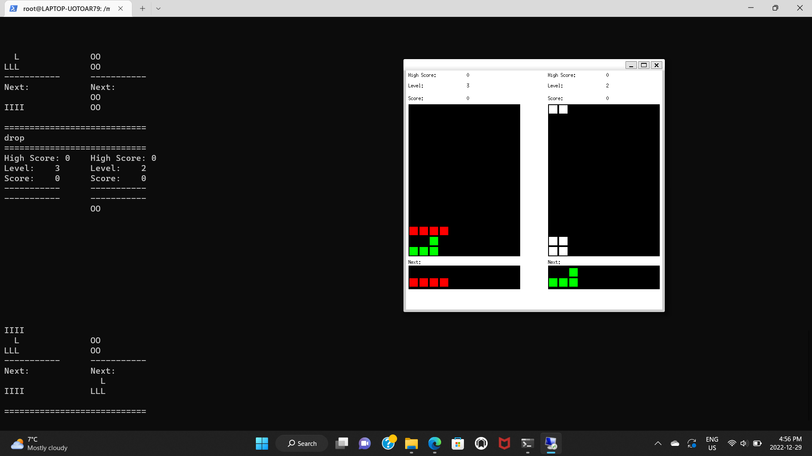

<h1 align="center">
	CS 246 Final Project
</h1>
<h2 align="center" id="disclaimer"><b>Disclaimer</b></h2>

<b>
Since this project is a school project, the source code for this project is not available in a public repository. What is here is the bare minimum to run the program. This is due to academic integrity concerns by the university as this assignment is often reused.
<u>
If you wish to see the source code, please reach out to me and provide your GitHub account information. You can reach me by email at s4sikdar@uwaterloo.ca.
</u>
</b>

<ul>
<li>
<a href="#about">Description</a>
</li>
<li>
<a href="#rules">Game Description</a>
</li>
<li>
<a href="#game_play">Screenshot</a>
</li>
<li>
<a href="#design">Design</a>
</li>
<li>
<a href="#instructions">Installation</a>
</li>
</ul>
<h2 align="center" id="about">Project Description</h2>

 
This is the repository for our CS 246 final group project. In our offering of CS 246, there was a fifth assignment
worth 15% of our mark, which could be done alone or in a group of 2 or 3. We chose to do this project as a group. The project
had 3 choices games to choose from and create. We created biquadris, which is essentially multiplayer tetris (but on one
machine). Our final grade was 97.2, as shown below. This project was made in collaboration with <a href="https://github.com/Peterk3275761769">Peter Kuvshinov (https://github.com/Peterk3275761769)</a> and <a href="https://github.com/kelvinhh">Kelvin (Haonian) Pan (https://github.com/kelvinhh)</a>.

<h2 align="center" id="rules">
Game Description
</h2>

The game has 2 boards that show. One board is shown for each player. On each board, you will see the scoreboard,
the level, as well as the high score. You will also see the next block that will be placed on the board. When it is
your turn, you will be able to type commands in the command line that cause the blocks to move left, right, down, rotate 
clockwise or counterclockwise, as well as drop a piece on the board. The commands are as follows:
<ul>
<li>left

left moves the piece left by one unit.

</li>
<li>right

right moves the piece right by one unit.

</li>
<li>down

down moves the piece down by one unit.

</li>
<li>clockwise

clockwise rotates the piece clockwise.

</li>
<li>counterclockwise

counterclockwise rotates the piece counter-clockwise.

</li>
<li>drop

drop drops the piece onto the board. It drops the piece as far down as it can possibly move. Once the piece is dropped, 
then only does the game switch turns. Even if the piece hits the ground using the down command or as a function of the level,
the game doesn't switch turns till the drop command is used.

</li>
<li>levelup

levelup increases the level up by one. In the upper levels, pieces are selected such that it is harder for you to clear a row.
Also, whenever you move on the board, the piece moves down one to make the game harder. Note that as the levels are harder here,
clearing a level or a block adds more to your score.

</li>
<li>leveldown

leveldown decreases the level down by one.

</li>
</ul>
For each of the commands, you can prepend a number to it to repeat it that many times (i.e. "3down" repeats the down command 3 times). There
are other commands mainly reserved for testing. See "biquadris.pdf" if you are interested to know more.

<h2 align="center" id="game_play">Game Screenshot</h2>

<h2 align="center" id="design">Design</h2>

Our project made use of the X11 graphics library. Our project made use of the Observer pattern to
render the output to the command line and to the X11 graphics display. We also made use of the
decorator pattern to design the blocks of the game. More detailed information is available in a
design document (required for the assignment) and a UML diagram (also made for the assignment) that is stored separately.
If you wish to access these pdfs along with the source code, please reach out to me with your github info as specified in the
<a href="#disclaimer">disclaimer section</a>.

<h2 align="center" id="instructions">Installation Instructions</h2>
<ol>
<li>
Ensure that you have the Windows Subsystem for linux instualled, or that you have Linux installed. Information on how to install
the Windows Subsystem for Linux can be found here: <a href="https://learn.microsoft.com/en-us/windows/wsl/install">https://learn.microsoft.com/en-us/windows/wsl/install</a>.
</li>
<li>
Ensure that you have the X11 graphics library installed on your machine as well. This can be installed using the apt command on linux with the right packages: <a href="https://askubuntu.com/questions/213678/how-to-install-x11-xorg">https://askubuntu.com/questions/213678/how-to-install-x11-xorg</a>.
</li>
<li>
Ensure that you have the XMing display server installed on your machine: <a href="https://sourceforge.net/projects/xming/">https://sourceforge.net/projects/xming/</a>.
If you are using a Mac, you should probably download XQuartz: <a href="https://www.xquartz.org/">https://www.xquartz.org/</a>.
</li>
<li>
Clone this repository.
</li>
<li>
Enter into Linux, or your subsystem for Linux, and go the folder containing this README in the repository.
</li>
<li>
Open the XMing graphics server.
</li>
<li>
Run the command "./biquadris" in this folder.
</li>
<li>
Enjoy the game.
</li>
</ol>
